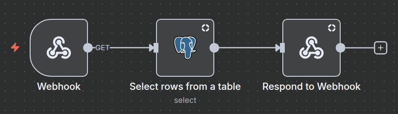
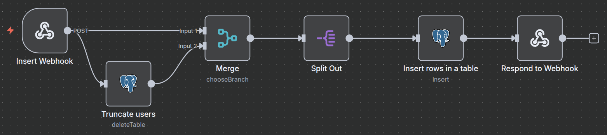
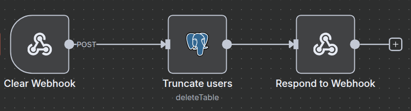

# Fullstack Test Application

This project was developed as part of a technical test for a **Fullstack Developer** position.
The goal was to create a complete flow connecting **React (frontend)**, **Express (backend)**, **n8n workflows**, and **PostgreSQL**, ensuring data automation and persistence.

---

## Tech Stack

- **Frontend**: React + Vite + TailwindCSS
  - I opted for **Vite** instead of Next.js because the application is a simple **single page** and didn’t require server-side rendering or routing.
- **Backend**: Node.js + Express
- **Database**: PostgreSQL (hosted on **Neon**)
- **Automation/Workflows**: n8n (cloud instance)
- **Deployment**: Vercel (for both frontend and backend)

---

## Application Overview

1. **Frontend**
   - Built with React + Vite + TailwindCSS
   - Displays a table of users (`<table>`).
   - Provides two buttons:
     - **Execute** → Fetches encrypted data → decrypts in API → sends to n8n → stores in PostgreSQL → Fetches all users.
     - **Clear** → Calls n8n workflow that truncates the users table.
   - Automatically updates UI without page reload (React state management).
   - Supports **pagination** (10 users per page).

2. **Backend**
   - Built with **Express**.
   - **Routes created**:
       - `GET /api/users` → Calls n8n "Get Users" workflow (SELECT in Postgres).
       - `POST /api/execute` → Decrypts, then calls n8n "Insert Users" workflow.
       - `POST /api/clear` → Calls n8n "Clear Users" workflow (TRUNCATE).

3. **Database Schema**
  ```sql
    CREATE TABLE users (
      id SERIAL PRIMARY KEY,
      nome VARCHAR(128) NOT NULL,
      email VARCHAR(255) UNIQUE NOT NULL,
      phone VARCHAR(20) NOT NULL
    );
  ```

4. **n8n Workflows**
   - **Get Users**: `Webhook (GET)` → `Postgres SELECT` → `Respond to Webhook`.
   - **Insert Users**: `Webhook (POST)` → `Postgres TRUNCATE` → `Merge (to keep the req body data)` → `Split Out (to normalize the body data to use on insert)` → `Postgres Insert` → `Respond to Webhook`.
   - **Clear Users**: `Webhook (POST)` → `Postgres TRUNCATE` → `Respond to Webhook`.

## Workflows

Below are the three workflows created in **n8n**:

1. **Get Users Workflow**
   

2. **Insert Users Workflow**
   

3. **Clear Users Workflow** 
   

---
